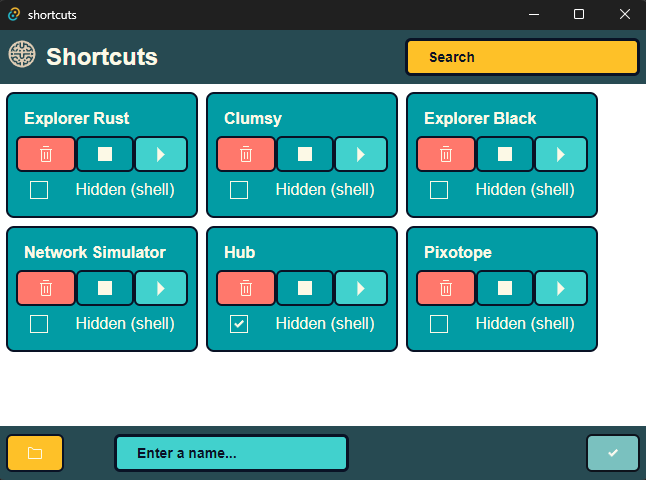

# Tauri + Solid + Typescript

Introducing Shortcuts: Your Ultimate Windows Executable Launcher

Experience the ultimate convenience with Shortcuts, the must-have app for effortlessly launching your Windows executables directly from your disk.

Key Features:

🚀 Simple Shortcut Creation: Select any executable file on your disk, assign it a name, and let Shortcuts do the rest. It's as easy as that!

📜 Effortless Management: Once added, your shortcuts will be neatly organized in a list. You'll have complete control, allowing you to start, stop, or delete them from your database in a snap.

🔍 Quick Search: Find your shortcuts in no time with our intuitive search functionality. Say goodbye to endlessly scrolling through lists.

🌟 Stealth Mode: Start your applications with the terminal window hidden, ensuring a seamless and distraction-free experience.

Shortcuts is here to streamline your workflow, making it easier than ever to access and manage your favorite Windows executables. Try it now and take control of your shortcuts like never before!

<div align="center">
   
</div>

### Start

```bash
cargo run ./main.rs
```

### Start

```bash
yarn start
```

### Rust Update

```bash
cd ./src-tauri
cargo update
```

#### Default export

```bash
tauri build
```
